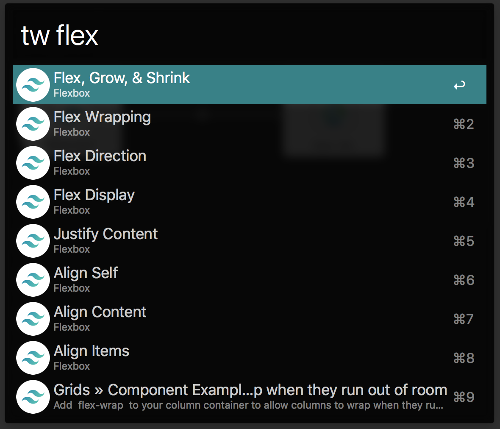

# Tailwindcss Docs Workflow for Alfred

An ultra-fast Tailwindcss docs search workflow for [Alfred 3](https://www.alfredapp.com).



## Installation

1. [Download the latest version](https://github.com/chrisrenga/alfred-tailwindcss-docs/releases/download/0.2.1/Tailwindcss.Docs.alfredworkflow)
2. Install the workflow by double-clicking the `.alfredworkflow` file
3. You can add the workflow to a category, then click "Import" to finish importing. You'll now see the workflow listed in the left sidebar of your Workflows preferences pane.

## Usage

Just type `tw` followed by your search query.

```
tw <query>
```

E.g.
```
tw flex
```

Either press `⌘Y` to Quick Look the result, or press `<enter>` to open it in your web browser.

## Thanks
Inspired by [tillkruss Alfred Laravel docs](https://github.com/tillkruss/alfred-laravel-docs)